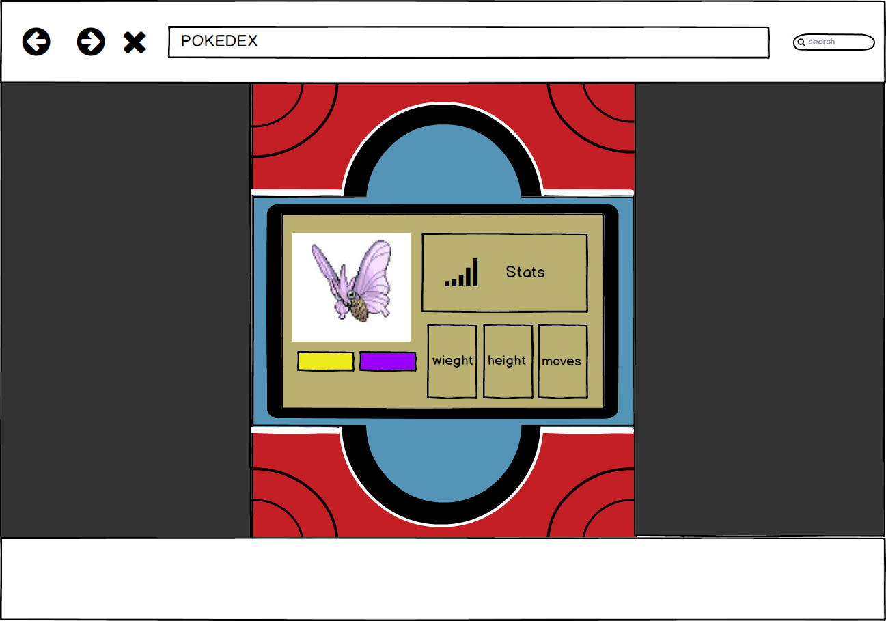

# Front end Mission JavaScript

:rage4:

## Prácticas resueltas para Microsoft launch X

### Viajero: R. F. Brayan Axel

***
## Caso: Pokédex :confetti_ball:

---

Requerimientos:
Se necesita crear un pokédex, un sitio donde los fans puedan buscar sus pokemons favoritos.

Se usaran tecnologias como HTML, CSS y Js.

Para buscar a los pokemones se hará uso de la api oficial la [PokéAPI](https://pokeapi.co/)

Se requiere conocer de cada busqueda; altura, movimientos o habilidad principal, estadisticas y tipo(s).

## Diseño

Existen varios modelos de pokédex y para este proyecto se tomara como base el pokédex de de la serie X/Y

## Mockup

Para tener una idea más clara de lo que se va a realizar se elaboro un bosquejo con ayuda de [Balsamiq Mockups](https://balsamiq.com/)

### Lista de mejoras a futuro

- colocar detalles de las esquinas (circulos negros)
- Arreglar las medidas de la imagen o de la pantalla principal para que todos los sprites quepan sin problema
- Los sprites no deberian modificar el tamaño de los demas elementos
- Cambiar los colores del tipo segun el pokemon buscado
- Agregar barra de progreso que represente las estadisticas.
- Cada busqueda incorrecta debe limpiar todos los campos.